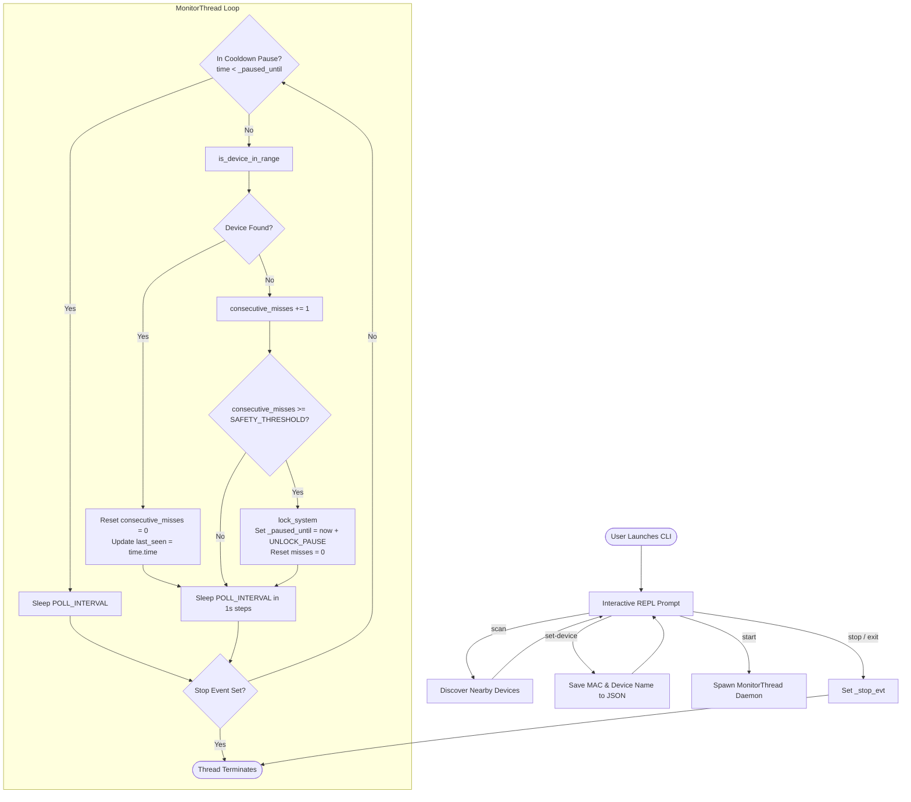

# 🏛️ Proximity Lock System — Architecture & Developer Guide

Welcome to the **Proximity Lock System** codebase documentation. This document is designed to help contributors and developers understand the internal architecture, lifecycle workflows, module design, and contribution opportunities.

---

## 1. System Overview

**Proximity Lock System** is a security utility that continuously tracks a user's paired Bluetooth device (such as a smartphone). When the device leaves Bluetooth range for a configured safety threshold, the application automatically triggers an operating system-level workstation lock.

### Key Objectives
* **Zero-Touch Security:** Automatically lock unattended workstations when the user steps away.
* **Anti-Flapping & Cooldown:** Uses consecutive miss thresholds (`SAFETY_THRESHOLD`) and post-lock pauses (`UNLOCK_PAUSE`) to prevent rapid re-locking while the user logs back in.
* **Cross-Platform Readiness:** Abstracts OS lock mechanisms across Windows, macOS, and Linux.

---

## 2. Directory Structure

```
Proximitylocksystem/
├── assets/                                 # Visual assets, branding & screenshots
├── Platform/
│   ├── Linux/                              # Placeholder for Linux-specific packages
│   ├── Mac/                                # Placeholder for macOS-specific packages
│   └── Windows/                            # Current Python package distribution
│       ├── proximity_lock_system/          # Core package
│       │   ├── __init__.py                 # Package version definition (v2.1.0)
│       │   ├── cli.py                      # Interactive REPL interface & command handlers
│       │   ├── config.py                   # Persistent configuration management
│       │   ├── core.py                     # Monitoring thread & OS lock triggers
│       │   └── utils.py                    # Bluetooth discovery wrappers
│       ├── requirements.txt                # Package dependencies (pybluez, pybluez-win10)
│       └── setup.py                        # Setuptools build configuration
├── ARCHITECTURE.md                         # This architecture guide
├── latency.png                             # Performance and latency benchmark graph
├── LICENSE                                 # GNU General Public License v3.0
├── proximity-lock-system.gif               # Application workflow demo
└── README.md                               # User-facing README documentation
```

---

## 3. Component Deep Dive

### 3.1 [`config.py`](Platform/Windows/proximity_lock_system/config.py) — Configuration & Persistence
Handles reading, writing, and resetting configuration saved at `~/.proximity_lock_config.json`.

* **Configuration Schema:**
  | Key | Type | Default | Description |
  | :--- | :--- | :--- | :--- |
  | `PHONE_MAC` | `str \| null` | `None` | Bluetooth MAC address of the target device. |
  | `DEVICE_NAME` | `str \| null` | `None` | Friendly name of the target Bluetooth device. |
  | `POLL_INTERVAL` | `int` | `10` | Frequency (in seconds) between scans. |
  | `UNLOCK_PAUSE` | `int` | `180` | Cooldown period (in seconds) after a lock is triggered. |
  | `SAFETY_THRESHOLD` | `int` | `2` | Number of consecutive failed scans before locking. |
  | `SCAN_DURATION` | `int` | `5` | Duration (in seconds) for each Bluetooth inquiry. |

* **Key Functions:**
  * `load_config()`: Reads JSON file, merging with default fallback values.
  * `save_config(cfg)`: Writes dictionary to `~/.proximity_lock_config.json`.
  * `reset_config()`: Removes configuration file.

---

### 3.2 [`utils.py`](Platform/Windows/proximity_lock_system/utils.py) — Bluetooth Discovery
Provides Bluetooth hardware interfacing via `pybluez`.

* **Key Function:**
  * `discover_nearby_devices(duration=5)`: Calls `bluetooth.discover_devices(duration=duration, lookup_names=True)`. Normalizes raw results into standard `(mac_address, device_name)` tuples. Returns an empty list safely if Bluetooth is disabled or unavailable.

---

### 3.3 [`core.py`](Platform/Windows/proximity_lock_system/core.py) — Monitoring Engine & OS Locking
Contains the core monitoring thread and cross-platform lock execution logic.

* **Key Functions & Classes:**
  * `lock_system()`: Detects host OS via `platform.system()` and invokes the appropriate lock command:
    * **Windows:** `rundll32.exe user32.dll,LockWorkStation`
    * **macOS (Darwin):** `/System/Library/CoreServices/Menu Extras/User.menu/Contents/Resources/CGSession -suspend`
    * **Linux:** `gnome-screensaver-command -l` & `xdg-screensaver lock`
  * `is_device_in_range(target_mac, duration)`: Runs a discovery scan and case-insensitively tests for `target_mac`.
  * `MonitorThread(threading.Thread)`:
    * Runs as a background daemon thread.
    * Executes the monitoring loop with pause/cooldown logic (`_paused_until`).
    * Tracks `consecutive_misses` and triggers `lock_system()` when the safety threshold is exceeded.
    * Updates `last_seen` timestamp on successful scans.
    * Responsive shutdown via `_stop_evt`.

---

### 3.4 [`cli.py`](Platform/Windows/proximity_lock_system/cli.py) — Interactive REPL
Provides the terminal interface and interactive prompt `proximity-lock>`.

* **Supported REPL Commands:**
  * `scan`: Performs Bluetooth discovery and caches the device list.
  * `set-device <index>`: Saves the selected device from the last scan into the persistent configuration.
  * `start`: Instantiates and starts `MonitorThread`.
  * `stop`: Stops the active `MonitorThread`.
  * `status`: Shows monitoring status, last seen timestamp, and current configuration parameters.
  * `reset`: Clears stored configuration.
  * `help`: Displays available commands.
  * `exit` / `quit`: Gracefully terminates monitoring and exits.

---

## 4. End-to-End Workflow & State Machine



---

## 5. Developer Guide & Roadmap

### Recommended Improvements for Contributors

1. **Top-Level Package Unification:**
   * Move `proximity_lock_system` to the repository root to serve Windows, macOS, and Linux from a single codebase rather than maintaining duplicate platform directories.

2. **BLE (Bluetooth Low Energy) & RSSI Integration:**
   * Modern smartphones often turn off classic Bluetooth discovery broadcasts when the settings screen is closed.
   * Integrating BLE RSSI proximity via libraries like [`bleak`](https://github.com/hbldh/bleak) will provide reliable, low-power continuous proximity tracking.

3. **CLI Arguments & Headless Mode:**
   * Add CLI argument parsing (`argparse` or `click`) so users and background scripts can run `proximity-lock start --daemon` without requiring interactive REPL input.

4. **Background / System Tray Support:**
   * Implement system tray minimization (e.g. using `pystray`) for running silently in the background without keeping an open terminal window.

---

## 6. Local Development & Setup

```bash
# 1. Clone repository
git clone https://github.com/Akarshjha03/ProximityLockSystem.git
cd Proximitylocksystem/Platform/Windows

# 2. Create and activate virtual environment
python -m venv venv
venv\Scripts\activate  # On Windows
# source venv/bin/activate  # On Linux/macOS

# 3. Install in editable mode
pip install -e .

# 4. Run the CLI
proximity-lock
```
